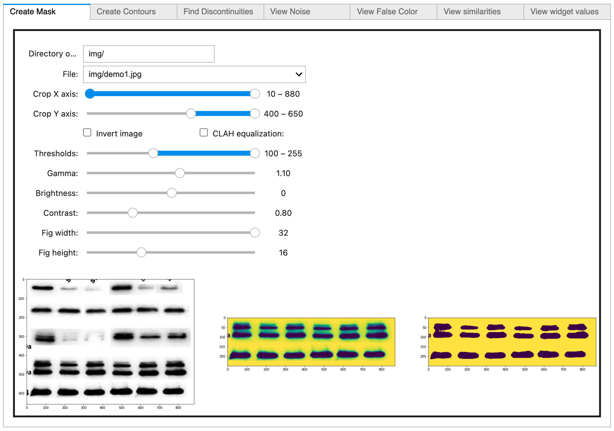
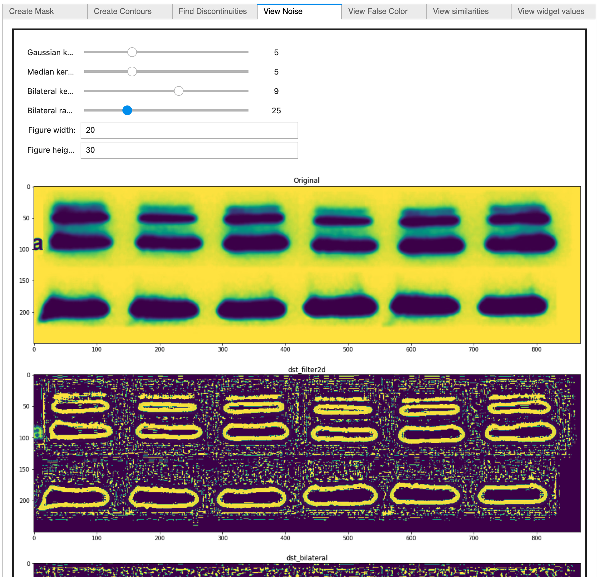
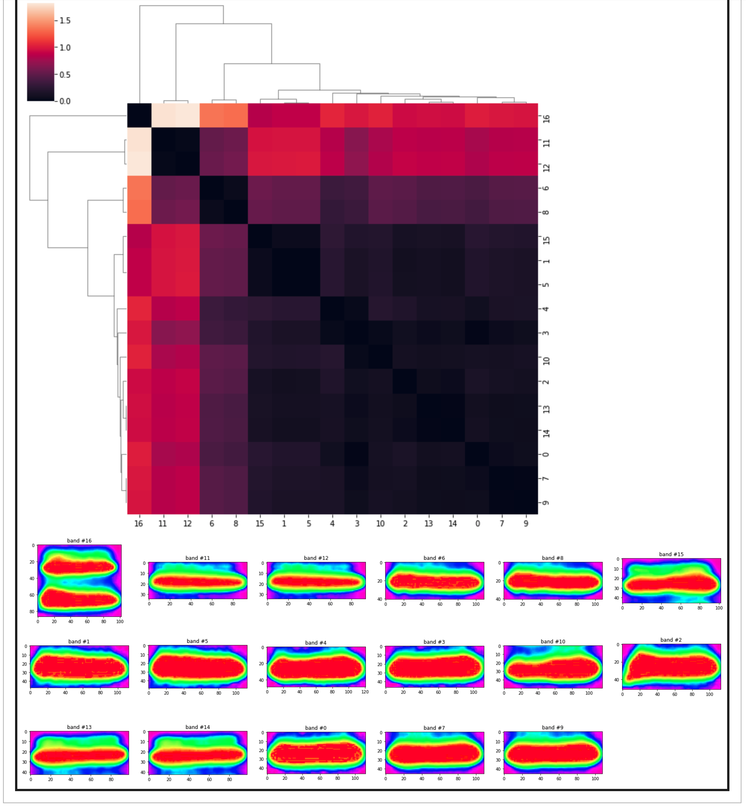

# UNCONCEALED
A series of tools and Jupyter widgets for evaluating images,
to aid in forensic investigation or reporting. 
Unconcealed allows you to apply a series of transformations to 
a directory of images, allowing you to visualize evidence of 
image splicing or duplication.

## How it works
The primary feature of Unconcealed is a Jupyter widget that 
lets you select images, apply a mask, then access various
transformation and visualization tools via tabs. 




The widget also displays a record of all parameters used 
during an evaluation, allowing for reproducibility of the
work.

A specific feature captures and compares contours of image
elements (eg Western Blot bands), revealing similarities 
that may be the result of image duplication.



## Installation

### Getting started
The basic installation will need you to open your terminal and 
run:

`pip install unconcealed`

If you are using Python environments along with Jupyter, 
make sure that you install unconcealed into an environment 
accessible as a Jupyter kernel. You can read more about 
this from the [IPython documentation](https://ipython.readthedocs.io/en/stable/install/kernel_install.html#kernels-for-different-environments).

### Dependencies 
To use the full functionality of unconcealed, you will need to 
separately install the following dependencies. 

* pdfimages (only if you need to use the image extraction feature)
* Jupyter, Ipywidgets (if you want to use the interactive widget module)

## Usage
1. Start up your Jupyter notebook
2. Note the directory/s where the images are located
    1. If you need to, you can use unconcealed.extract_from_pdf() to create a directory containing all images from a PDF, with the ability to filter based on image size. This requires separate installation of pdfimages.
3. Import the widget module:

```python 
from unconcealed import widgets
```

4. Prepare and load the widget:

```python 
load_evaluation_widget(IMAGE_DIRECTORY)
```

5. Navigate through the tabs to perform various transformations of the selected image. 
6. Use the first tab to change directory, and select which image to analyze.

## How to contribute
We welcome contributions! Even if it is just 
[letting us know about an issue](https://github.com/oxpeter/unconcealed/issues). 

If you would like to contribute changes to the code:

1. Clone repo and create a new branch: 
   
`$ git checkout https://github.com/oxpeter/unconcealed -b name_for_new_branch`

2. Make changes and test
3. Submit Pull Request with comprehensive description of changes

## License
This software has been developed under the [MIT](./LICENSE) license